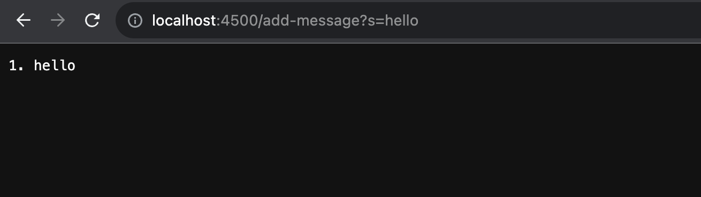
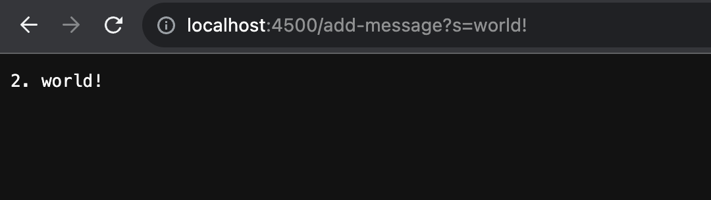

# **Lab Report 2**
by Eduardo Lopez

### Part 1: 
Code for StringServer:
```
import java.io.IOException;
import java.net.URI;

class Handler implements URLHandler {

    int num = 0;

    public String handleRequest(URI url) {
            if(url.getPath().contains("/add")){
                String[] parameters = url.getQuery().split("=");
                if(parameters[0].equals("s")){
                    num += 1;
                    return String.format(num + ". " + parameters[1] + "\n");
                }
                return "404 Not Found!";
            }
            return "";
    }
}

class StringServer {
    public static void main(String[] args) throws IOException {
        if(args.length == 0){
            System.out.println("Missing port number! Try any number between 1024 to 49151");
            return;
        }

        int port = Integer.parseInt(args[0]);

        Server.start(port, new Handler());
    }
}
```

ScreenShot Example 1:



ScreenShot Example 2: 



Explanation for both Screenshots:

For both screenshot examples, the **handleRequest** method is the one that handles the given request by the user. During this request, the important values are **/add-message?s=string** because **/add-message** is the path to the request, meaning it's what initiates the request where **s=string** is the query that changes and displays the given **string** value on the webpage. The whole request has to stay the way it is (**/add-message?s=string**) in order for **handleRequest** method not throw the error message **404 Not Found!**. The only thing that may change is **string** to any string value the user desires which is the difference from the first screenshot to the second screenshot example. Another important value that changes with every request is the **num** value in the **handleRequest** method. It updates with every given request and displays next the query value(which is another difference between the two screenshots). 

