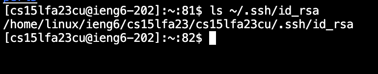
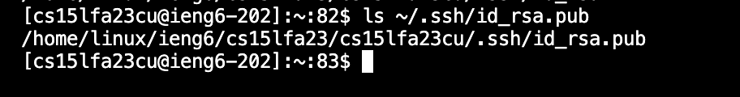
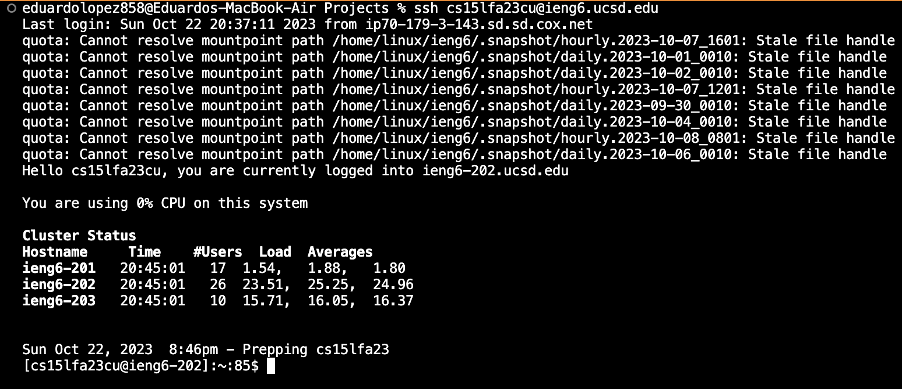

# **Lab Report 2**
by Eduardo Lopez

### Part 1: 
Code for StringServer:

### Part 2:
Screenshot of the private key path for **ssh**:

ScreenShot of the public key path for **ssh**:

Screenshot of login into **ieng6** without password:

### Part 3:

