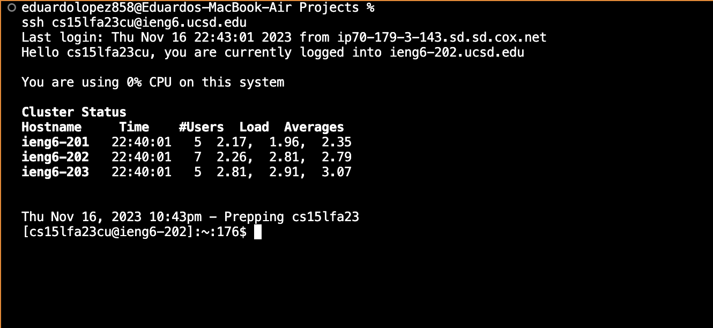
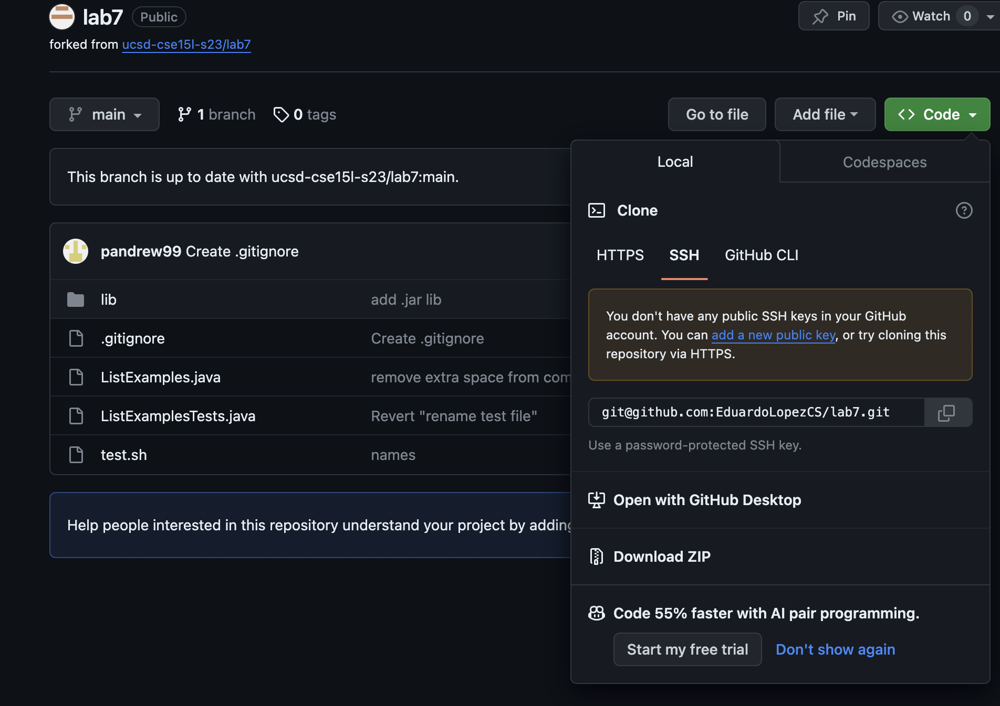
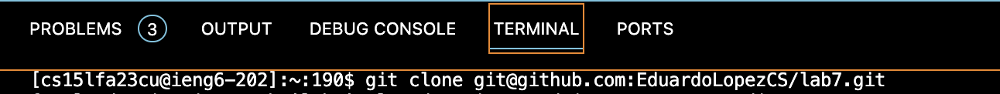
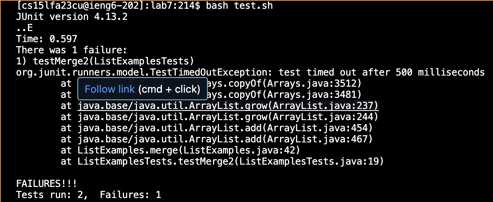
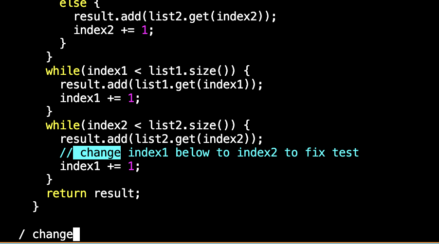
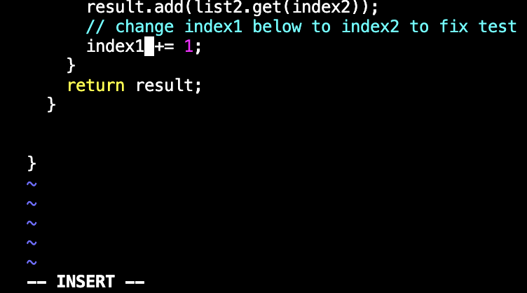
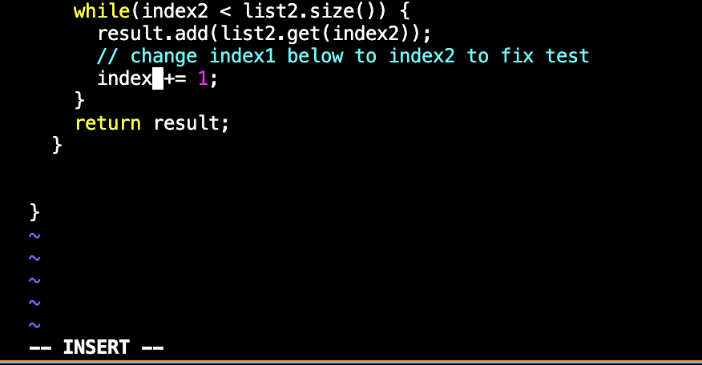
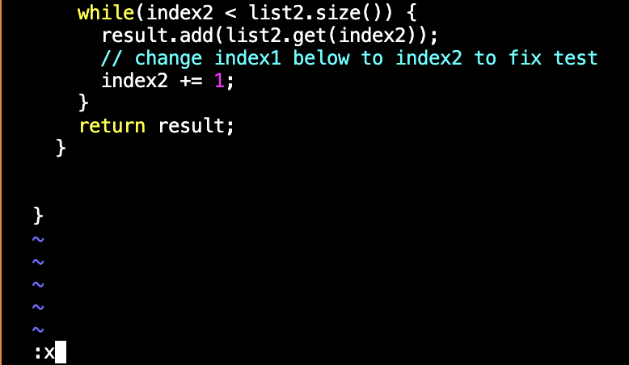
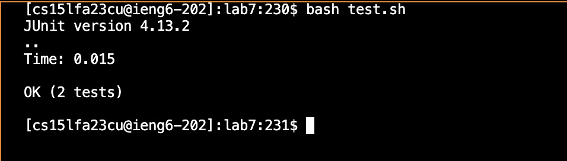
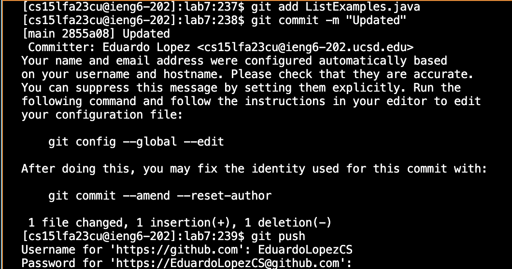

# **Lab Report 4**
by Eduardo Lopez

### First step:

**Keys pressed:** ``ssh cs15lfa23cu@ieng6.ucsd.edu < enter >``

**Summary: I used the ssh command to connect me to my ucsd account remotely, which is where I am going to be working off.**

### Second step:

**Keys pressed:** ``git clone git@github.com:EduardoLopezCS/lab7.git < enter >``

**Summary: I cloned the ssh url from the repository I forked. Then I cloned it into my ucsd account remotely. It has the files I am going 
to use the command vim with.**

### Third Step:

**Keys pressed:** ``bash test.sh < enter >``

**Summary: I used the testing bash script the repository came with(with Junit test command inside) to test the ListExamples.java file.
As you see in the image above, the test has one failure.**

### Fourth Step:

**Keys pressed:** ``vim ListExamples.java < enter >, / change < enter> < j > < l > < l > < l > < l > i < backspace > 2 < esc > :x <enter>``

**Summary: Using the vim command, I went into the file ListExamples.java in normal mode(vim). Then I used the forward slash command which is used for searching the first occurance of a specific string in vim to find the string "change", that way I had to use the j key less times to navigate to it. Then I used the j key once to move the curser down and the l key to make the curser move right 4 times. After that, I typed i to get me into insert mode instead of normal mode. I backspaced to delete the 1 in index and replaced it with 2, then pressed the escape key to exit out of insert mode back into normal mode. Now I just typed :x to quite vim and save the changed contents back into the file.**

### Fifth Step:

**Keys pressed:** ``bash test.sh < enter >``

**Summary: Now that I quite vim and back into the ieng6 terminal, I used the bash testing script command again from the third step to test the ListExamples.java file again. Now, both test were a success.**

### Sixth Step:

**Keys pressed:** ``git add ListExamples.java, git commit -m "Updated", git push``

**Summary: I used the git commands add, commit, and push to commit the file I edited with vim to my github account using my ucsd ieng6 account terminal.**
