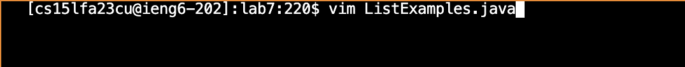
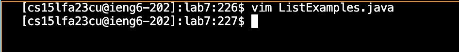

# **Lab Report 4**
by Eduardo Lopez

### First step:

**Keys pressed: ssh cs15lfa23cu@ieng6.ucsd.edu < enter >**

**Summary: I used the ssh command to connect me to my ucsd account remotely, which is where I am going to be working off.**

### Second step:

**Keys pressed: git clone git@github.com:EduardoLopezCS/lab7.git < enter >**

**Summary: I cloned the ssh url from the repository I forked. Then I cloned it into my ucsd account remotely. It has the files I am going 
to use the command vim with.**

### Third Step:

**Keys pressed: bash test.sh**

**Summary: I used the testing bash script the repository came with(with Junit test command inside) to test the ListExamples.java file.
As you see in the image above, the test has one failure.**

### Fourth Step:

**Keys pressed: **
