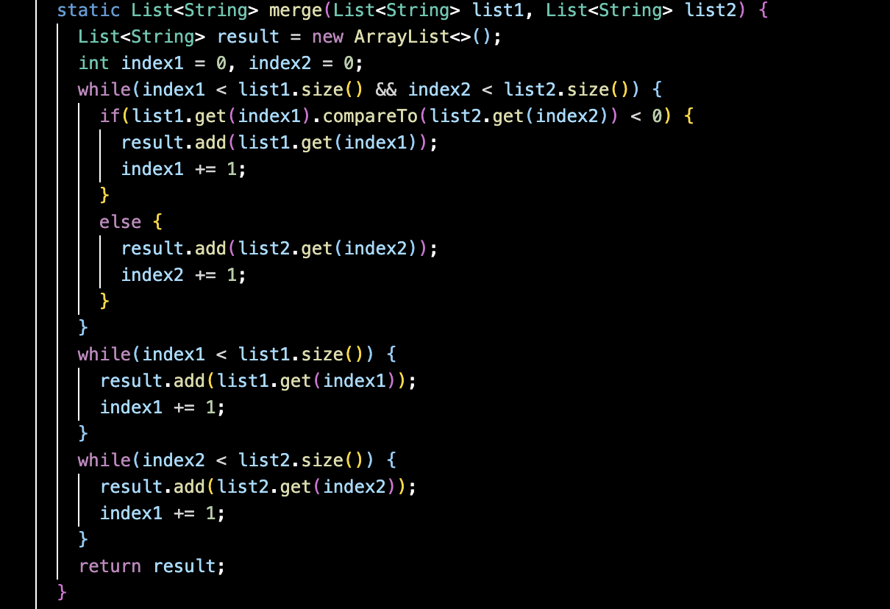

# **Lab Report 5**
by Eduardo Lopez

## Part 1:
## 1.1: 

Hello my name is Eduardo, I am having trouble figureing out what's creating this failure on my code. The Junit test says my ListExamples.java file is failing a test relating to a TestTimedOutException. I have a feeling it's related to the merge method where something isn't adding up correctly or merging correctly.

## 1.2:
Hello Eduardo, thank you for making your question private. From the looks of the symptom, there is a timeout error meaning the specific while loop condition isn't being met, resulting in an infinite loop. With that in mind, take a look at your while loops. What would need to be done in order the while loop to eventually break and return the proper resulting ArrayList?

## 1.3:

Thank you. I found the bug. It makes sense why there would be a timeout error. The conditions of my last while loop in my method would have never been met because it instead of updating index2 of the second list in the loop, I was updating the index1 which was already being done with the while loop above it. Thats why the loop never broke because the proper indeces weren't even being updated/iterated for it to move onto the next index on the second list. 

##1.4:
